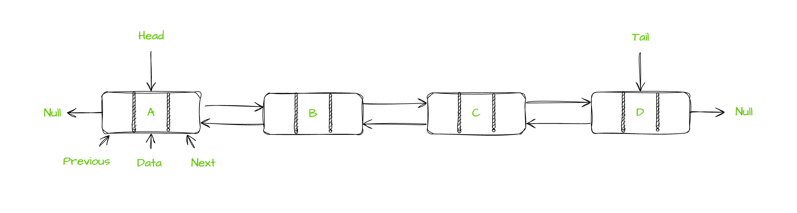

# Тема 1, Линеен двусвързан списък, 13.10.2023

## Линеен двусвързан списък

<br/>



<br/>

## Сравнение между вектор, свързан списък и двусвързан списък

| Vector    | LinkedList | DoublyLinkedList |
| -------- | ------- | ------ |
| Използва непрекъснат регион в паметта  | Данните са разпръснати в паметта    | Данните са разпръснати в паметта|
| Съхранява само паметта за всеки елемент | Освен всеки елемент в допълнение съхранява и връзка към следващия     | Освен всеки елемент в допълнение съхранява и връзки към предишния и следващия|
| Бърз достъп до произволен елемент    | Бавен достъп до произволен елемент    | Бавен достъп до произволен елемент|
| Премахването и добавянето на елементи е скъпа операция | Евтино добавяне и премахване на елементи. Добавянето на елемент в началото е бърза операция | Евтино добавяне и премахване на елементи. Добавянето на елемент в началото и в края(и на произволна позиция) е бърза операция |
| Можем да го обхождаме в произволен ред | Можем да го обхождаме само от първия към последния елемент | Можем да го обхождаме в двете посоки |

## Задачи - [Имплементация](solutions/dll.h) + [Тестове](solutions/tests.cpp)

### Зад. 1

Имплементирайте шаблонен клас `Node`, който ще представя един възел(една кутийка) в списъка. Класът трябва да съдържа в себе си реалната данна, която носи и указатели към следващ и предишен възел. Добавете:

    * конструктор по подразбиране
    * конструктор с един параметър от шаблонния тип
    * конструктор с параметър от шаблонния тип и два параметъра, които са указатели към друг възел

### Зад. 2

Създайте шаблонен клас `DoublyLinkedList`, който ще представя свързания списък. Преди да имплементирате голямата четворка, добавете няколко базови методи:

    * `void pushFront(const T&)` - добавя елемент в начало на списъка
    * `void popFront()` - премахва елемента от началото на списъка
    * `void pushBack(const T&)` - добавя елемент в края на списъка
    * `void popBack()` - премахва елемента от края на списъка
    * `void print()` - отпечатва всички елементи на списъка
    * `T head()` - връща елемента в началото на списъка
    * `T last()` - връща елемента в края на списъка

### Зад. 3

Имплементирайте голямата четворка за класа `DoublyLinkedListdList`.


### Зад. 4

Имплементирайте метод `void reverse()`, който обръща съдържанието на списъка. Пример:

```c++
DoublyLinkedListdList<int> l;
l.pushBack(1); l.pushBack(2); l.pushBack(3); // 1 <-> 2 <-> 3;
l.reverse(); // 3 <-> 2 <-> 1
```


### Зад. 5

Имплементирайте метод `void removeDuplicates()`, който премахва повторните срещания на всеки елемент. Пример:

```c++
DoublyLinkedListdList<int> l;
l.pushBack(1); l.pushBack(2); l.pushBack(3); l.pushBack(3); l.pushBack(1); l.pushBack(1); // 1 <-> 2 <-> 3 <-> 3 <-> 1 <-> 1;
l.removeDuplicates(); // 1 <-> 2 <-> 3
```