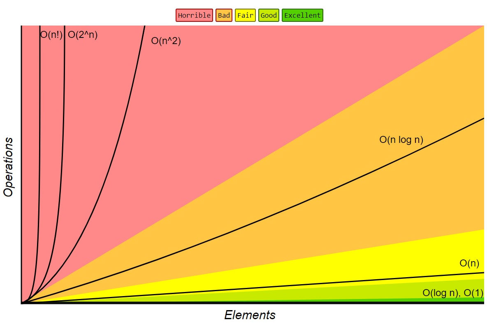

# Тема 5, Сложност на алгоритъм, 06.11.2023

Коя функция е по-бърза:

```c++
int f1(std::vector<int> numbers)
{
    int first = numbers[0];
    int second = numbers[1];
    return first + second;
}

int f2(std::vector<int> numbers)
{
    int result = 0;
    for (int n : numbers) result += n;
    return result;
}
```

Коя функция използва повече памет:

```c++
int f1(std::vector<int> numbers)
{
    std::vector<int> copy = numbers;
    int first = copy[0];
    int second = copy[1];
    return first + second;
}

int f2(std::vector<int> numbers)
{
    int result = 0;
    for (int n : numbers) result += n;
    return result;
}
```

## Big O notation


$f \in O(g) <=> \exists c \exists n_0 : \forall n > n_0 : f(n) <= g(n)$

**Свойства**

1. $f(n) = c.g(n) => O(f) = O(g)$

2. $f(n) = a_0 + a_1 * n + a_2 * n^2 + ... + a_m * n ^ m => O(f) = O(n^m)$

3. $f(n) = f_1(n) + f_2(n) + ... + f_m(n) => O(f) = O(max(f_1, f_2, ..., f_m))$

4. $f(n) = {\log_a n}, g(n) = {\log_b n} => O(f) = O(g)$


<br/>



<br/>

## Задачи

### Зад. 1

> credits to Петър Колев

Отворете [файла](./samples/functions.cpp) с примерни функции и оценете асимптотичната сложност по време на всяка една от тях.

| Функция      | Сложност |
| ----------- | ----------- |
| f1      | O(???)       |
| f2      | O(???)       |
| f3      | O(???)       |
| f4      | O(???)       |
| f5      | O(???)       |
| f6      | O(???)       |
| f7      | O(???)       |
| f8      | O(???)       |
| f9      | O(???)       |
| f10      | O(???)       |


### Зад. 2

Попълнете следната таблица със сложностите на базовите операции на досега изучаваните структури от данни.


| Структура от данни      | Достъп до произволен елемент | Достъп до първи елемент | Достъп до последен елемент | Търсене на елемент | Добавяне/изтриване на елемент на произволна позиция | Добавяне/изтриване на елемент в началото | Добавяне/изтриване на елемент в края | 
| ------------------- | ------ | ------ | ------ |  ----- |  ----- |  ---- |  ----- |
| Динамичен масив     |        |        |        |        |        |       |        |
| Свързан списък      |        |        |        |        |        |       |        |
| Двусвързан списък   |        |        |        |        |        |       |        |
| Стек                |   -    |        |   -    |        |        |   -   |    -   |


### Зад. 3

Напишете функция, която приема два двусвързани списъка и която връща нов списък, който представлява сумата им.

Пример:

```
Input: 
l1 = 1 <-> 4 <-> 2 <-> 3 (представя числото 1423)
l2 = 3 <-> 8 <-> 7 (представя числото 387)

Output:
 1 <-> 8 <-> 1 <-> 0 (представя числото 1810)
```

### Зад. 4

Напишете функция, която премахва повтарящите елементи в сортиран двусвързан списък.

### Зад. 5

Напишете функция, която приема двусвързван списък и число и която пренарежда списъка така че елементите в първата му част да са по-малки от това число, а елементите във втората част да са по-големи от това число.

Пример:

```
Input: 1 <-> 4 <-> 2 <->10 
x = 3

Output: 1 <-> 2 <-> 4 <-> 10
```

### Зад. 6

Напишете програма, която пресмята резултати от изборите. Нека гласовете са представени със списък от числа като всеки елемент представя един глас за номера на съответната партия.

Пример:

```
Input: [1, 83, 32, 28, 32, 1, 32]
Output:
2 гласа за партия 1
1 глас за партия 28
3 гласа за партия 32
1 глас за партия 83
```

Забележете, че броят на партиите не е ясен предварително, както и техните номера.