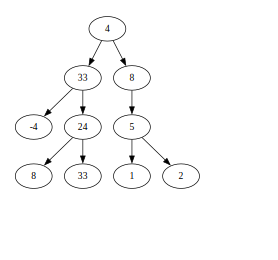
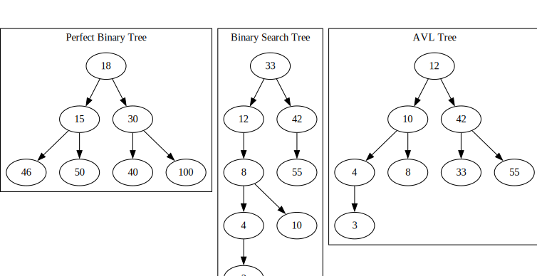
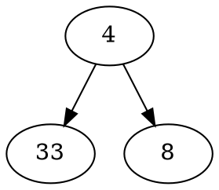

# Тема 6, Двоични дървета, 13.11.2023


<br/>



<br/>


## Видове дървета

<br/>



<br/>

## Представяне в паметта

```c++
template <typename T>
struct Node {
    T data;
    Node<T> *left, right;
}

Node<T> *root;
```

## Опериране с дърво

```c++

void f(Node<T> *root)
{
    if (root == nullptr)
        // Празното дърво
        return;

    // Правим нещо с root->data
    std::cout << root->data;
    
    // Извикваме операцията рекурсивно за лявото и дясното поддървета
    f(root->left);
    f(root->right);
}
```

## Визуализация

https://graphviz.org/documentation/

Онлайн визуализатор - https://dreampuf.github.io/GraphvizOnline/



## Задачи - [Решения](./solutions/btree.h)

### Зад. 1

Имплементирайте следните операции за двоично дърво:

* `bool member(const T& data)` - проверява дали има елемент в дървото с тази стойност. За примерното дърво отгоре `member(5)` връща `true`, но `member(12)` връща `false`

* `int height()` - връща височината на дървото(дължината на най-дългия път от корен до листо). За примерното дърво отгоре `height()` връща 3

* `int leafs()` - връща броя на листата в дървото. За примерното дърво отгоре `leafs()` връща 5

* `void print()` - отпечатва дървото на стандратния изход в желан от вас формат

* `void printDot()` - отпечатва дървото на стандартния изход в `dot` формат

* `T leftMostLeaf()` - връща най-лявото листо в дървото. За примерното дърво отгоре `leftMostLeaf()` връща -4

* `T min()` - връща най-малкия елемент в дървото спрямо релацията `<`. За примерното дърво отгоре `min()` връща -4


### Зад. 2

Имплементирайте голямата четворка за класа представящ двоично дърво.


### Зад. 3

Напишете фунцкия, която добавя елемент в дърво по даден път. Пътят се моделира с поредица от посоки `L`(посока наляво) и `R`(посока надясно). Пример:

* `add(6, "LLR")` - добавя 6 като десен наследник на елемента -4 в примерното дърво

* `add(6, "LLRR")` - хвърля грешка

* `add(6, "LR")` - хвърля грешка


### Зад. 4

Имплементирайте следните операции за двоично дърво:

* `int level(const T& data)` - връща нивото, на което се намира елементът. За примерното дърво отгоре `level(24)` връща 3, `level(2)` връща 4, a `level(56)` връща -1.

* `bool areCousines(const T& d1, const T& d2)` - проверява дали два елемента са братовчеди в дървото. Братовчеди са такива елементи, които са на едно ниво, но имат различни родители. За примерното дърво отгоре `areCousines(-4, 5)` връща `true`, но `areCousines(-4, 24)` връща `false`.

* `vector<T> levelItems(int level)` - връща елементите на ниво `level`. За примерното дърво отгоре `levelItems(3)` връща `[-4, 24, 5]`

* `Node<T> *lca(Node<T>* first, Node<T>* second)` - намира най-близкия общ предшественик на двете кутийки. В примерното дърво отгоре `lca` за -4 и 8 е 33, а за -4 и 2 е 4.

* `bool isSubTree(BTree<T> &other)` - проверява дали едно дърво е поддърво на друго. 

* `int diameter()` - връща диаметъра на дървото. Диаметър на дърво е дължината на най-дългия път(без повторения) между два възела. За примерното дърво диаметърът е 6.

* `bool isSymetric()` - проверява дали едно дърво е симетрично(огледален образ на себе си).

