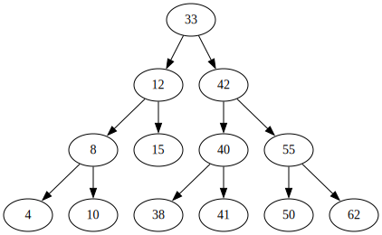

# Тема 7, Наредени двоични дървета, 27.11.2023

## Двоично търсене


## Двоично наредено дърво

* Празното дърво е наредено
* Дърво с корен, ляво поддърво и дясно поддърво е наредено, ако:

    * коренът е по-голям или равен на всеки елемент в лявото поддърво
    * коренът е по-малък или равен на всеки елемент в дясното поддърво
    * лявото поддърво е наредено
    * дясното поддърво е наредено




## Търсене в двоично наредено дърво


## Задачи 

Направете си копие на класа `BTree` от миналата седмица като запазите само голямата четворка и метода за печатане в `dot` формат. Кръстете новия клас `BSTree`.

### Зад. 1

Напишете функция `bool isBST()`, която проверява дали текущото дърво е двоично наредено.


### Зад. 2

Напишете следните функции за двоично наредено дърво:

* `bool member(const T& data)` -  проверява дали има елемент в дървото с тази стойност.
* `T min()` - връща най-малкия елемент в двоично нареденото дърво
* `T max()` - връща най-големия елемент в двоично нареденото дърво

### Зад. 3

Имплементирайте следните модифциращи операции за дървото:

* `void add(const T& data)` - добавя елемента в дървото и запазва наредбата
* `void remove(const T& data)` - изтрива елемента от дървото и запазва наредбата


### Зад. 4

Дефинирайте интерфейс(абстрактен клас, който има само чисто виртуални функции), представляващ структура от данни, която позволява ефективно търсене, добавяне и премахване на елементи.

```c++
template <typename T>
class Set
{
public:
    virtual bool contains(const T& data) = 0;
    virtual void add(const T& data) = 0;
    virtual void remove(const T& data) = 0;
    virtual int size() = 0;
    virtual bool empty() = 0;
}
```

Добавете клас наследник `TreeSet`, който имплементира методите с помощта на двоично наредено дърво. 


### Зад. 5

Използвайте класа `TreeSet`, за да имплементирате ефективно следните функции:

* `int countUniques(const std::vector<int>& data)` - връща броя на уникланите елементи във вектора.
* `bool twoSum(const std::vector<int>& data, int target)` - връща истина, тстк съществуват два елемента във вектора, чиято сума е равна на `target`.


### Зад. 6

Добавете метод `std::vector<T> range(const T& from, const T& to)` към класа `BSTree`, който връща всички елементи на дървото, които са в диапазона `[from, to]`.