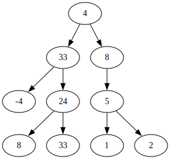

# Тема 8, Итератори за двоични дървета, 04.12.2023

## Обхождане на дърво



Тип обхождане           |  Наредба
:-------------------------:|:-------------------------:
`inorder` (ЛКД) | [-4, 33, 8, 24, 33, 4, 1, 5, 2, 8]
`preorder` (КЛД) | [4, 33 -4, 24, 8, 33, 8, 5, 1, 2]
`postorder` (ЛДК) | [-4, 8, 33, 24, 33, 1, 2, 5, 8, 4]

## Обхождане чрез стек

```c++
void print(Node<T> * root)
{
    if (root == nullptr)
    {
        return;
    }

    print(root->left);
    std::cout << root->data;
    print(root->right);
}
```

### Стъпка 1

Стек със състоянията     | 
:-------------------------:|
print( root = 33)|
std::cout<<( root = 4)|
print( root = 8)|

### Стъпка 2

Стек със състоянията     | 
:-------------------------:|
print( root = -4)|
std::cout<<( root = 33)|
print( root = 24)|
std::cout<<( root = 4)|
print( root = 8)|

### Стъпка 3

Стек със състоянията     | 
:-------------------------:|
print( nullptr)|
std::cout<<( root = -4)|
print( nullptr)|
std::cout<<( root = 33)|
print( root = 24)|
std::cout<<( root = 4)|
print( root = 8)|

### Стъпка 4

Стек със състоянията     | 
:-------------------------:|
std::cout<<( root = -4)|
print( nullptr)|
std::cout<<( root = 33)|
print( root = 24)|
std::cout<<( root = 4)|
print( root = 8)|

### ...

### Стъпка 7

Стек със състоянията     | 
:-------------------------:|
print( root = 24)|
std::cout<<( root = 4)|
print( root = 8)|

### ...


## Задачи - [Решения](./solutions/btree.h)

### Зад. 1

Имплементирайте методи, които връщат всички елементи на дадено дърво:

* `std::vector<T> inorder()` - обхожда елементите в поредност "ляво-корен-дясно". За дърво с корен, ляво поддърво и дясно поддърво в резултатния вектор всички елементи на лявото поддърво се намират преди корена, а всички елементи в дясното поддърво се намират след корена.
* `std::vector<T> preoder()` - обхожда елементите в поредност "корен-ляво-дясно". За дърво с корен, ляво поддърво и дясно поддърво в резултатния вектор всички елементи на лявото поддърво се намират след корена, а всички елементи в дясното поддърво се намират след тези на лявото.

### Зад. 2

Имплементирайте метод, който отпечатва на екрана всички елементи на дадено дърво в `inorder` наредба. Използвайте стек за обхождане вместо рекурсия.

* `void printInorderStack()`

### Зад. 3

Имплементирайте итератор за класа двоично дърво. Нека итераторът обхожда дървото в `inorder` наредба.

```c++
template <typename T>
class BTreeIterator
{
public:
    BTreeIterator(Node<T> *);
    BTreeIterator<T> &operator++();
    T operator*();
    bool operator!=(const BTreeIterator<T> &);  
};

template <typename T>
class BTree
{
public:
    // ...
    BTreeIterator<T> begin();
    BTreeIterator<T> end();
    // ...
};
```

(За домашно имплементирайте йерархичен итератор, който обхожда елементите на дървото ниво по ниво отляво надясно. Жокер: използвайте BFS алгоритъм и опашка/двусвързан списък)

### Зад 4.

Имплементирайте `map` операция, която обхода дървото през итератор и променя елементите му, прилагайки функция, подадена като входен параметър.

* `void map(std::function<T(T)> f)`