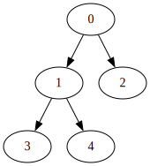
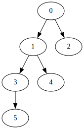
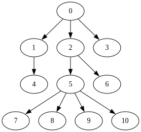

# Тема 9, Още за дървета, 11.12.2023

## Балансирано двоично дърво

* Празното дърво е балансирано
* Дърво с корен, ляво поддърво и дясно поддърво е балансирано, ако:
    * височината на лявото и дясното поддървета не се различава с повече от 1
    * лявото поддърво е балансирано
    * дясното поддърво е балансирано

Балансирано дърво           |  Небалансирано дърво
:-------------------------:|:-------------------------:
  |  

## Дърво с много наследници

## Задачи

### Зад. 1

Добавете метод към класа за двоично дърво, който проверява дали текущото дърво е балансирано. Оценете сложността по време на решението си. Ако тя е O(n^2), намерете по-ефективно О(n) решение.

### Зад. 2

Добавете статичен метод към класа за наредено двоично дърво, който приема сортиран вектор от елементи и построява балансирано наредено двоично дърво от него.

* `static BSTree balanced(const std::vector<T>&)`

### Зад. 3

За класа двоично дърво имплементирайте:

* `std::list<std::list<T>> allPaths()` - метод, който връща всички пътища от корен до листо в дървото
* `std::list<std::list<T>> allLevels()` - метод, който връща всички нива в дървото 

### Зад. 4

За класа, представляващ дърво с произволен брой наследници от тип `std::string`, имплементирайте метод, който проверява дали всяко ниво представлява едно и също изречение.

### Зад. 5

За класа, представляващ дърво с произволен брой наследници, имплементирайте методи:

* `void serialise()` - отпечатва дървото на екрана в `scheme` формат
    * (<корен> (<поддърво_1> <поддърво_2> ... <поддърво_n>))
    * за примерното дърво отгоре - (0 ((1 (4 ()) (2 ((5 ((7 () (8 ()) (9 ()), (10 ()))), (6 ())))))))
* `static Tree<T> deserialise(std::istream&)` - създава дърво, прочитайки съдържанието му от поток, който съдържа низ в `scheme` формат

### Зад. 6

Имплементирайте методи, които оценяват двоично дърво от стрингове:

* Нека дървото се състои само от стринговете "AND", "OR", "true", "false". Оценката на едно такова дърво е
    * `true`/`false`, ако стойността на корена е "true" или "false"
    * <оценката на лявото поддърво> <операция> <оценка на дясно поддърво>, ако стойността на корена е операция "AND"/"OR

* Нека дървото се състои от стрингове "+", "-", "*" и такива, които представляват числа. Оценката на дървото се сформира на същия прицнип като предната поддточка. Имплементирайте версия на този метод за дърво с произволен брой наследници

### Зад. 7

Имплементирайте метод за класа двочино дърво, който приема двоично наредено дърво и който връща списък от дърветата, които се получават при изтриване на елементите на оригиналното дърво, които се съдържат в двоично нареденото дърво.