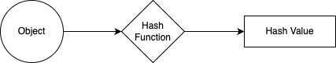
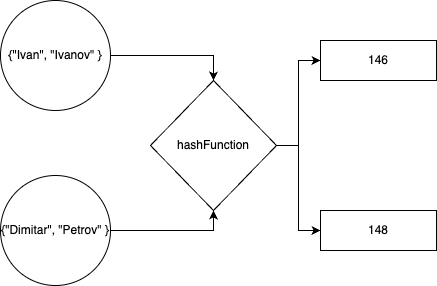
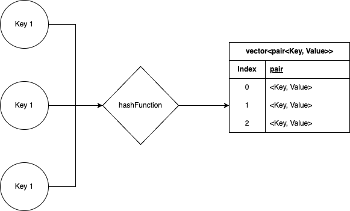

# Тема 10, Хеш таблици, 18.12.2023

## Хеширане




### Пример

Обект:
```c++
struct Student
{
    std::string firstName;
    std::string lastName;
};

Student ivan = {"Ivan", "Ivanov"};
```

Хешираща функция:
```c++
int hashFunction(Student s)
{
    return s.firstName[0] + s.lastName[0];
}
```

Хеш стойност: `146`





## Хеш таблица



### Пример

```c++
struct StudentData
{
    int fn;
    std::string address;
    std::vector<double> grades;
    // 
    // ...
    //
};

StudentData ivanData = {81352, "Sofia", {5.5, 6, 3}, ...};
```

index         |  ```vector<pair<Student, StudentData>>```
:-------------------------:|:-------------------------:
0 | 
1 | 
2 | 
... | 
... | 
... |
146 | `<{"Ivan", "Ivanov"}, {81352, "Sofia", {5.5, 6, 3}, ...}>`
... |
... |
... |


## Колизии

```c++
Student ivan = {"Ivan", "Ivanov"};
Student bobi = {"Boyan", "Petrov"};
hashFunction(ivan) == hashFunction(bobi); // 146
```

Решение:

* [Separate Chaining](https://www.geeksforgeeks.org/separate-chaining-collision-handling-technique-in-hashing/)
    * `vector<pair<Student, StudentData>>` -> `vector<list<pair<Student, StudentData>>>`
* [Open Addressing](https://www.geeksforgeeks.org/open-addressing-collision-handling-technique-in-hashing/)

## Добра хешираща функция

1. Детерминистична
2. Равномерно разпределена (устойчива на колизии)
3. Ефикасна и бърза за пресмятане

`std::hash`

## Задачи

### Зад. 1

Създайте шаблонен клас `HashTable`, който представя хеш таблица. Добавете конструктор, който приема параметър за размера на таблицата.

### Зад. 2

Добавете основните функционалности:

* `bool containsKey(const Key&)` - проверява дали в таблицата се съдържа двойка, чиито ключ е подаденият на метода параметър
* `Value get(const Key&)` - връща стойността съответстваща на подадения на метода ключ
* `void put(const Key&, const Value&)` - добавя нова двойка ключ и стойност към таблицата
* `bool empty()` - проверява дали таблицата е празна
* `int size()` - връща броя на двойките в таблицата

### Зад. 3

Добавете операция за махане на двойка ключ и стойност от таблицата:

* `void remove(const Key&)` - премахва двойката съответстваща на подадения на метода ключ

### Зад. 4

Добавете още функционалности:

* `double efficiency()` - изчислява съотношението на ключовете с колизия към всички ключове
* `std::vector<Key> keys()` - връща всички ключове в таблицата
* `std::vector<Value> values()` - връща всички стойности в таблицата

### Зад. 5

Добавете имплементация `HashSet` на [интерфейса `Set` от тема 7](https://github.com/demilev/sdp-2023-2024/blob/main/07-bstree/README.md#%D0%B7%D0%B0%D0%B4-4).

### Зад. 6

* Използвайки хеш таблица, намерете O(n) решение на [задача 6 от тема 5](https://github.com/demilev/sdp-2023-2024/blob/main/05-complexity/README.md#%D0%B7%D0%B0%D0%B4-6---%D1%80%D0%B5%D1%88%D0%B5%D0%BD%D0%B8%D0%B5)
* Напишете функция, която приема вектор от цели числа и цяло число `k` и която намира дължината на най-дългата подредица от последователни елементи, чиято сума е `k`.