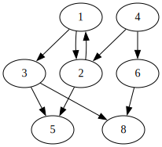
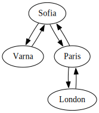
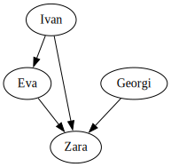
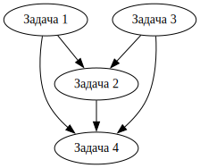

# Тема 11, Графи, 08.01.2024

## Граф

$ V = \{v_1, v_2, v_3, \ldots, v_n\}, |V| = n $

$Е \subset V \times V = \{(v_{i_1}, v_{j_1}), (v_{i_2}, v_{j_2}), \ldots, (v_{i_m}, v_{j_m})\}, |E| = m$

* Върхове - [1, 2, 3, 4, 5, 6, 8]
* Ребра - [(1, 2), (1, 3), (2, 1), (2, 5), (4, 2), (4, 6), (6, 8), (3, 5)]

## Видове графи

* ориентирани/неориентирани
* с примки/без примки
* с тежести на ребрата/без тежести на ребрата
* мултиграф
* цикличен/ацикличен
* свързан
* ...

Връзки м/у градове           |  Социална мрежа | Зависимост на задачи
:-------------------------:|:-------------------------:|:-------------------------:
 |  | 

## Представяне

1. Матрица на съседство
    * `bool adjMatrix[][]`, `matrix[i][j]` - дали има ребро между връх `i` и връх `j`
    * Използва се за представяне на гъсти графи(такива с много ребра) 
2. Списък на съседство
    * `unordered_map<int, list<int>> adjList`, `adjList[i]` - списъкът от съседите на връх `i`
    * подходящ за разредени графи(такива с малко ребра)
3. Списък на ребра
    * `list<pair<int, int>> edges` - списък от наредени двойки, описващи ребрата между върховете
    * подходящ за проблеми, при които ребрата са осовния фокус

## Задачи

### Зад. 1

Имплементирайте клас `Graph`, който представя даден граф. Използвайте списъци на съседство и приемете, че върховете в графа са просто числа. Имплементирайте следните методи:

* `void addVertex(int)` - добавя нов връх
* `void addEdge(int, int)` - добавя ребро между два върха
* `std::list<int> getAdjacent(int)` - връща всички върхове, към които даден връх има ребро
* `void printDot()` - отпечатва графа в `dot` формат

### Зад. 2

Имплементирайте следните функции:

* `int numberOfParents(int vertex, const Graph& graph)` - намира броя на върховете в графа, които имат ребро до `vertex`
* `bool isPath(const std::list<int>& path, const Graph& graph)` - проверява дали `path` e път в графа. За примерния граф отгоре `{1, 2, 5}` е път в графа, но `{1, 4, 6, 8}` не е.
* `bool pathExists(int from, int to, const Graph& graph)` - проверява дали съществува път в графа между два върха

### Зад. 3, DFS

Имплементирайте DFS обхождане на графа:

* `std::list<int> dfs(const Graph& graph)` - връща списък на върховете в графа обходени в последователност на DFS алгоритъма

### Зад. 4, BFS

Имплементирайте BFS обхождане на графа:

* `std::list<int> bfs(const Graph& graph)` - връща списък на върховете в графа обходени в последователност на BFS алгоритъма

### Зад. 5

Използвайки BFS, напишете фунцкия, която намира всички пътища(без повторения) между два върха в граф:

* `std::list<std::list<int>> allPaths(int from, int to, const Graph& graph)`

### Зад. 6

Използвайки DFS, напишете функция, която намира топологическото сортиране на даден граф. Топологическо сортиране на граф е такава наредба на върховете му, в която всеки връх стои преди всичките си наследници.

* `std::list<int> topoSort(const Graph& graph)` - за примерния граф на задачи отгоре едно примерно сортиране е `{Задача 1, Задача 3, Задача 2, Задача 4}`

### За домашно

Направете класа `Graph` шаблонен, за да поддържа данни от произволен тип.
		