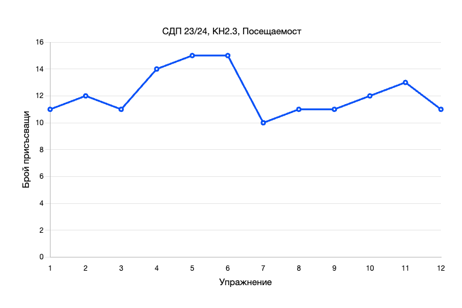

# Тема 12, Подготовка за изпит, 15.01.2024

## Анонимна анкета за обратна връзка

https://www.surveymonkey.com/r/6SLM85M

## Статистика за семестъра

### Общо решени задачи - **67**

### Общо имплементирани структури от данни - **7**

<br/>



<br/>


## Задaчи за свързан списък

Използвайки следния клас, който представя една кутийка в свързан списък

```c++
class Node
{
public:
    T data;
    Node *previous;
    Node *next;

    Node(const T &);
};
```

### Зад. 1

Имплементирайте функция `Node<T>* merge(Node<T>* list1, Node<T>* list2)`, която приема указатели към началото на два сортирани списъка и връща указател към нов списък, който представлява сортираното обеднинение на двата.

### Зад. 2

Имплементирайте функция `Node<T>* rotate(Node<T>* head, int k)`, която приема указател към началото на списък и параметър `k` и премества всяка кутийка на списъка с `k` позиции надясно.


## Задачи за стек

### Зад. 1

Имплементирайте функция `decodeString`, която приема символен низ и го декодира по следните правила:

 - един кодиран низ се състои от числа, малки латински букви и символите `[` и `]`
 - числото показва колко пъти съдържанието в скобите след него трябва да се повтори
 - може да има влагане на скоби

```
Примерен вход:
3[a]2[bc]
Примерен изход:
aaabcbc

Примерен вход:
3[a2[c]]
Примерен изход:
accaccacc
```


## Задачи за дърво

Използвайки следния клас, който представя една кутийка в двоично дърво

```c++
template <typename T>
struct Node
{
    T data;
    Node<T> *left;
    Node<T> *right;

    Node(const T &);
    Node(const T &, Node<T> *, Node<T> *);
};
```

### Зад. 1

Имплементирайте функция `T kthSmallest(Node<T>* root, int k)`, която приема указател към корена на двоично наредено дърво и параметър `k` и която връща `k`-ият най-малък елемент в дървото.

### Зад. 2

Имплементирайте функция `Node<int>* trim(Node<int>* root, int from, int to)`, която приема указател към корена на двоично наредено дърво и два параметъра `from` и `to` и която маха всички елементи на дървото, които са извън отворения интервал (`from`, `to`). 


## Задачи за хеш таблица

### Зад. 1

Имплементирайте:

* функция, която намира общите елементи на два вектора
* функция, която проверява дали съществуват два елемента в даден вектор, чиято сума е дадено число

## Задачи за графи

### Зaд. 1

Напишете функция, която приема ориентиран граф и която проверява дали в графа има цикъл.