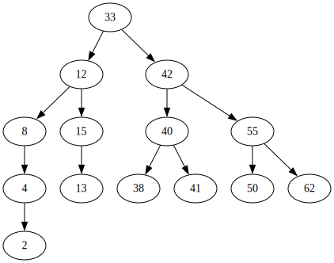
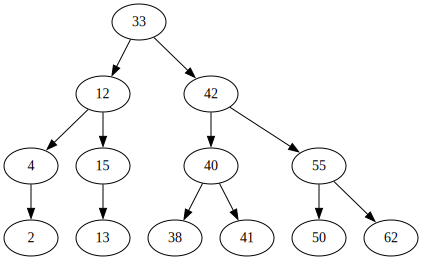
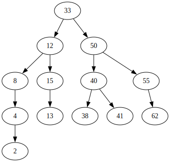

# Триене от двоично наредено дърво

## Триене на листо

Оригиналното дърво           |  Дървото след изтриване на елемента 50
:-------------------------:|:-------------------------:
  |  

## Триене на елемент с един наследник

Оригиналното дърво           |  Дървото след изтриване на елемента 8
:-------------------------:|:-------------------------:
  |  

## Триене на елемент с два наследника

Оригиналното дърво           |  Дървото след изтриване на елемента 42
:-------------------------:|:-------------------------:
  |  